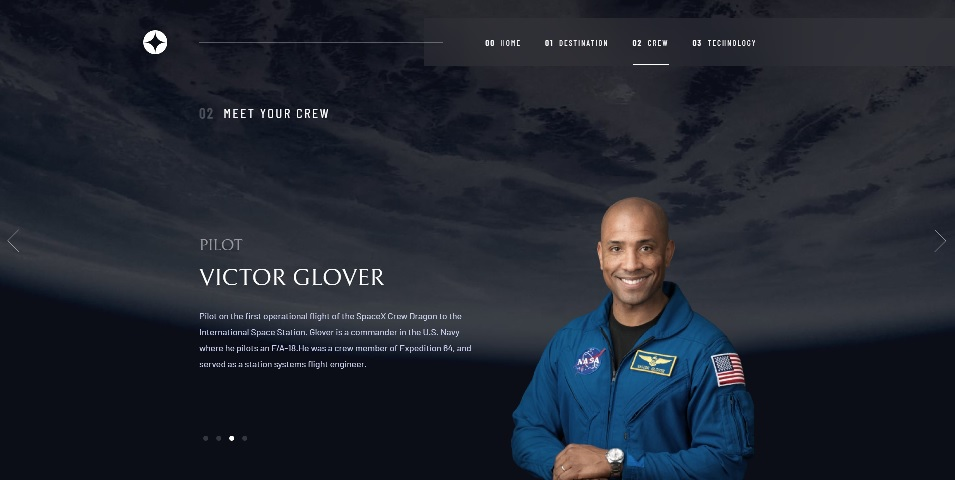

# Frontend Mentor - Space tourism website solution

This is a solution to the [Space tourism website challenge on Frontend Mentor](https://www.frontendmentor.io/challenges/space-tourism-multipage-website-gRWj1URZ3). Frontend Mentor challenges help you improve your coding skills by building realistic projects. 

## Table of contents

- [Overview](#overview)
  - [The challenge](#the-challenge)
  - [Screenshot](#screenshot)
  - [Links](#links)
- [My process](#my-process)
  - [Built with](#built-with)
  - [About application](#about-application)
  - - [Mobile Menu](#mobile-menu)
  - - [JSON](#json)
  - - [Warnings](#warnings)
  - [Continued development](#continued-development)
  - [Useful resources](#useful-resources)
- [Author](#author)

## Overview

### The challenge

Users should be able to:

- View the optimal layout for each of the website's pages depending on their device's screen size
- See hover states for all interactive elements on the page
- View each page and be able to toggle between the tabs to see new information

- The challenge for me was to build a Javascript application that will retrieve data via the JSON API.

### Screenshot



### Links

- Solution URL: [Add solution URL here](https://your-solution-url.com)
- Live Site URL: [Add live site URL here](https://your-live-site-url.com)

## My process

### Built with

- CSS custom properties
- Flexbox
- Mobile-first workflow
- Javascript
- Boilerplate
- JSON
- Figma

### About application

I used the Boilerplate frontend template, version 8.0.0 to build the application.
The application was built according to the principles of Mobile First.

Each page uses the two basic CSS sheets, normalize.css and main.css. Each page has its own individual style, e.g. crew.css.

The normalize.css file was not modified.
The main.css file, apart from the standard entries for the template, contains:
- definitions for menu / mobile menu / page header / logo,
- definitions for fonts,
- color definitions in variables.

Basic CSS is for mobile view. To adjust views for other devices, I used media query for min 768px for tablets and min 992px for Desktop view.

Each page as a skeleton is built of two sections described by classes:
- header-container - contains the menu, logo and separator for the Desktop view
- main-container - contains the rest of the content

I used flexbox to position the content on the website in each section.


The height of the body on each page, in each view, is calculated by Javascript as the height of the browser window to fill the window in 100%. The function adds the min-height style to the body element. The width is always 100% but the maximum width of the content containers is 1110px.

path ./js/main.js
```js

getWindow()
...
bodyHeight.style.minHeight = window.innerHeight + 'px';
...

```

The width of the navigation bar is calculated by Javascript relative to the automatically set left margin of the page header. The function adds the width style to the nav element, but only for resolutions greater than 992px.

path ./js/main.js
```js
    if (window.innerWidth > 992) {
        getMargin()
    }

getMargin()
...
const siteHeaderMargin = parseInt(getComputedStyle(siteHeader).marginLeft);
const mainNavWidth = (window.innerWidth - siteHeaderMargin - 450) + 'px';
...

```


### Mobile Menu

Selectors and javascript functions for the mobile menu can be found in:
- CSS ./css/main.css
- Javascript ./js/main.js

The openMenu() function is called by clicking the mobile menu icon.
I used to add or remove 'active' class depending on the state.
For a more interesting animation, I run the menu by changing the opacity, width and height.

```css
.main-nav {
  width: 0;
  height: 0;
  opacity: 0;
}

.main-nav.active {
  width: 60%;
  height: 100%;
  opacity: 1;
}

```

### JSON

Data is loaded via API on N Point using Javascript Fetch API. The data is updated with a set of functions. Each subpage has its own API connection js file. Each page selects data from different object. The name of the js file refers to the subpage.
In the future, you can standardize files and reference specific functions.

More details you can find inside files as comments.

e.g.
```js
const loadJsonData = async () => {
    try {
        const requestURL = '';
        const response = await fetch(requestURL);
        const data = await response.json();

        populateDestinations(data);

    } catch (e) {
        console.log('error: ', e);
    }
}

```

### Warnings

In the Figma project, the main menu background blur effect was supposed to be added. Unfortunately, it is poorly supported. In main.css I added a conditional definition of backdrop-filter support. 

```css
@supports ((-webkit-backdrop-filter: blur (81px)) or (backdrop-filter: blur (81px))) {
  .main-nav {
    background-color: var (- white-transparent);
    -webkit-backdrop-filter: blur (81px);
    backdrop-filter: blur (81px);
  }
}
```

In the challenge, I focused on building a website that is almost 100% look as the Figma project. The design should be tuned for a resolution between 992px and 1440px.

The data is loaded via the JSON API available from the free API testing platform. https://api.npoint.io/. Sometimes a page reload is required.
In the future, a some conditions should be added to check the data load status.

### Continued development

This challenge works perfectly with screen >1400px, 768-992px and <768px.
During building, I tried to keep the perfect dimensions in relation to the Figma project.
In normal situation I would suggest use more responsive domension like viewport height or width instead of px or clamp for responsive fonts.

### Useful resources

I used front-end template Boilerplate 5

- [Boilerplate v8.0.0](https://html5boilerplate.com/) - Used for normalize CSS to fast start and get the document compatible with mostly used browsers.
- [N Point](https://api.npoint.io/) - Free API platform. You upload your JSON file to test your application.

## Author

- Website - [Lukasz Gasiecki](https://supraweb.dev)
- Frontend Mentor - [@LucaTwentySeven](https://www.frontendmentor.io/profile/LucaTwentySeven)
- Codepen - [@lukaszgasiecki](https://codepen.io/collection/PYGwpg)


